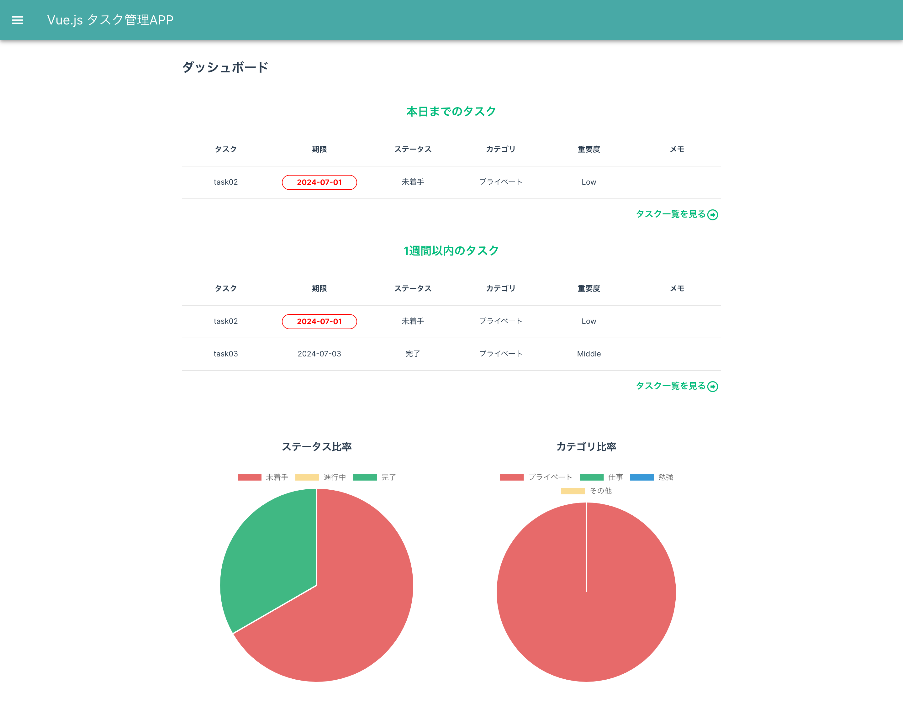
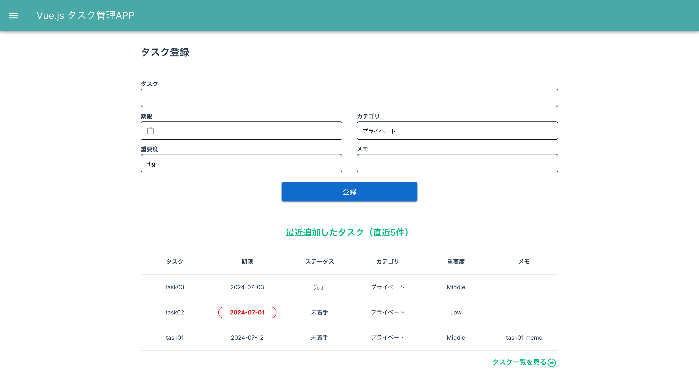
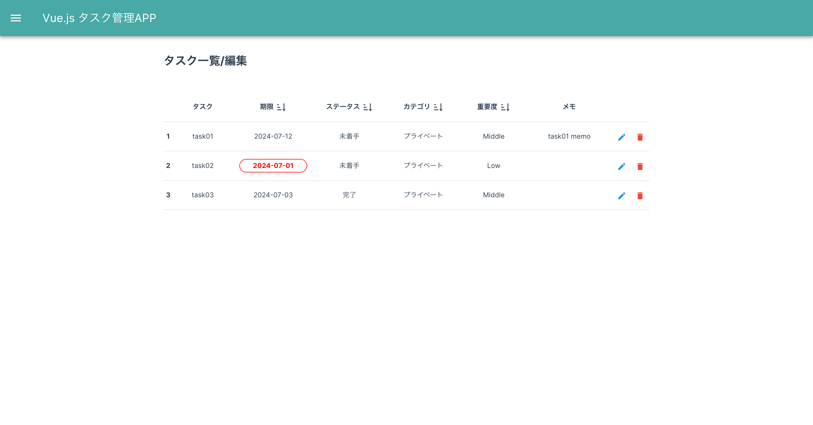
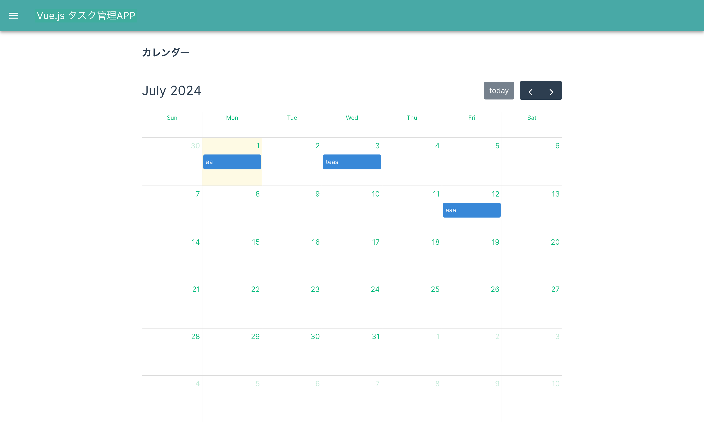

# The-View

タスク管理アプリです 
タスク登録後、ステータスのPieチャートやカレンダーに反映され、視覚的にタスク管理できます。  
レスポンシブ対応しているのでスマホからもご利用いただけます。

 
 
 
 
 <imgwidth="350" height="700"  alt="スクリーンショット" src="./images/sp_dashboard.png">
 <imgwidth="350" height="700"  alt="スクリーンショット" src="./images/sp_inputtask.png">
 <imgwidth="350" height="700"  alt="スクリーンショット" src="./images/sp_tasklist.png">
 <imgwidth="350" height="700"  alt="スクリーンショット" src="./images/sp_calendar.png">

# URL

https://vue-tasklist-five.vercel.app/ 
最初に「タスク登録」画面でタスク追加後、「ダッシュボード」「タスク一覧/編集」「カレンダー」の画面を確認できます。

# 使用技術

- vue: ^3.4.29,
  - vue-router: ^4.4.0,
  - vue-chartjs: ^5.3.1,
  - vuetify: ^3.6.10
- fullcalendar

## デプロイ

- Vercel

# 機能一覧

- 投稿/編集/削除 機能(localStorage)
- カレンダー(fullcalendar)
- カテゴリ/ステータスのPieチャート(charts.js)
